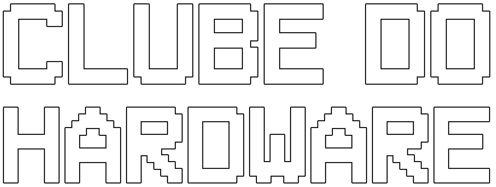
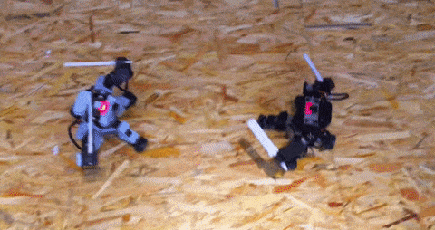
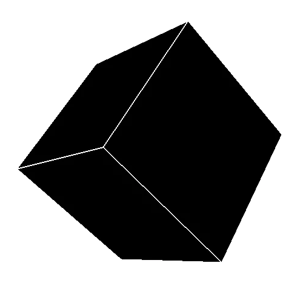

<p align="center">
  <a href="https://github.com/lemostrash/Clube-do-Hardware">
    
  </a>
</p>

[](#discord)
## 🦾 Descubra o Clube do Hardware 👩‍💻👩🏻‍💻

O Clube do Hardware é um fórum renomado, repleto de perguntas sobre problemas de TI e muito mais. Mas aqui, nossa proposta vai além! Nosso clube oferece um diferencial único, com encontros semanais ou mais, onde nos reunimos para colocar a mão na massa, criar projetos e estudar juntos.

Sabe o que faz falta no meu dia a dia, e provavelmente no seu também? Ter pessoas com quem conversar sobre os assuntos que estudamos e criar projetos em conjunto. Nossa ideia inicial é dar início a um campeonato amador de luta de robôs, feitos por nós mesmos, além de competições de CTF para os apaixonados por segurança da informação. Esses são apenas exemplos dos projetos que podemos realizar, mas para isso, precisamos de pessoas interessadas em embarcar nessa jornada.

Seja você um iniciante ou especialista, venha fazer parte do Clube do Hardware e explore um mundo de oportunidades para ampliar conhecimentos, criar laços e dar vida às ideias mais inovadoras. Vamos construir esse futuro juntos! Ingresse agora mesmo no nosso Discord e faça parte dessa comunidade!

## 💡 Ideias 

Qualquer ideia é bem-vinda, delas podemos treinar o que estudamos na sala de aula ou naquele cursinho pago da udemy, o networking está muito aquecido nesse meio já que para ter um grande conhecimento devemos compartilhar ou até mesmo ensinar, se você ensina para alguém um assunto significa que você o domina bem.

## 🦾 Hardware é daora 🦾

Não sei você, mas sempre que eu vejo algo sobre robotica penso naqueles campeonatos de luta de robos, você simplesmente criar seu robo com papelão e garrafa pet e colocar para brigar com outro robo feito dos mais aleatorios materiais e componentes, o legal de juntar uma boa quantidade de pessoas com interesses desse genero é que podemos criar o nosso proprio campeonato amador, ok que o intuito é ver dois robos brigando, mas a trejetoria para construir o robo é necessario estudar uma linguagem de programação, saber sobre os componentes eletronicos que vamos usar e até mesmo saber lidar com trabalho em equipe, então é um grande sonho criar algo do genero com pessoas diversas de cursos diferentes e etc.

<p align="center">
    
      </a>
</p>


## 👨‍🚀 Ser hacker não é só assistir Mr Robot 

Muitos alunos querem seguir na area de segurança mas infelizmente n sabem por onde começar, uns começam apenas usando programas já automatizados 100% mas não sabe o que rola por trás dele, uma base boa de redes de computadores, saber o que cada processo faz independente da area de segurança que você quer seguir vai te dar vantagem para saber lidar com certos problemas, então a ideia de criar novas amizades com os mesmos interesses pode te ajudar a ter uma noção por onde começar a estudar sobre, campeonatos de CTF amadores feitos por nós ou até mesmo quem tem a pontuação mais no hackaflag já é um inicio para começar a ter aquela competitividade amigavel e satisfatoria.

<p align="center">
    
      </a>
</p>

## 👩‍💻 Programar faz bem 👩‍💻 

Criar ferramentas ou até mesmo sites é uma incrível forma de colocar o aprendizado em dia, somos programadores e ter ao menos 1 linguagem de programação sendo o nosso segundo idioma, por assim dizer, é mais que necessário. Se unir com alunos de outros cursos é bom, porque podemos ter uma demanda, podemos resolver o problema deles simplesmente programando algo hehe.

## :sound: Discord :sound:

### Espero que tenha se interessado, se quiser participar no grupo do Discord e até mesmo WhatsApp é clicar no cubo

<p align="center">
  <a href="https://discord.com/invite/qH6bQXdj">
    
      </a>
</p>


## Contribuidores
### Este projeto existe graças a todas as pessoas que contribuem.

<table>
  <tr>
   <td align="center">
     <a href="https://github.com/lemostrash">
        
        </br>
       <sub>
        <b>Lemostrash</b>
      </sub>
      </a>
      </td>
      <!-- ------INSIRA SUA CONTRIBUICAO ACIMA DESTA LINHA -->
        </tr>
</table>


<!-- ------COMO INSERIR SUA CONTRIBUICAO ACIMA DESTA LINHA -->
</table>
 </tr>
  
  <!-- EXEMPLO DE CONTRIBUIDOR -->
  <!-- <td >
      <a href="{LINK DE PERFIL}">
        
        <sub>
        <b>NOME DE USUARIO</b>
        </sub>
      </a>
    </td> -->
  </tr>
</table>


#### Ps: Ainda estamos finalizando o site do Clube, se você quiser contribuir na construção dele, qualquer ajuda é bem vinda :)


```python
┌──(club@root)-[~/]
└─$ cat nao_pode_faltar.py

class Lemostrash:

███╗   ██╗ █████╗  ██████╗ 
████╗  ██║██╔══██╗██╔═══██╗
██╔██╗ ██║███████║██║   ██║
██║╚██╗██║██╔══██║██║   ██║
██║ ╚████║██║  ██║╚██████╔╝
╚═╝  ╚═══╝╚═╝  ╚═╝ ╚═════╝ 
                           
    ███████╗███████╗     ██╗ █████╗ 
    ██╔════╝██╔════╝     ██║██╔══██╗
    ███████╗█████╗       ██║███████║
    ╚════██║██╔══╝  ██   ██║██╔══██║
    ███████║███████╗╚█████╔╝██║  ██║
    ╚══════╝╚══════╝ ╚════╝ ╚═╝  ╚═╝

██████╗  █████╗ ██████╗  █████╗  ██████╗ █████╗ 
██╔══██╗██╔══██╗██╔══██╗██╔══██╗██╔════╝██╔══██╗
██████╔╝███████║██████╔╝███████║██║     ███████║
██╔══██╗██╔══██║██╔══██╗██╔══██║██║     ██╔══██║
██████╔╝██║  ██║██████╔╝██║  ██║╚██████╗██║  ██║
╚═════╝ ╚═╝  ╚═╝╚═════╝ ╚═╝  ╚═╝ ╚═════╝╚═╝  ╚═╝
                                                                                                       
```
